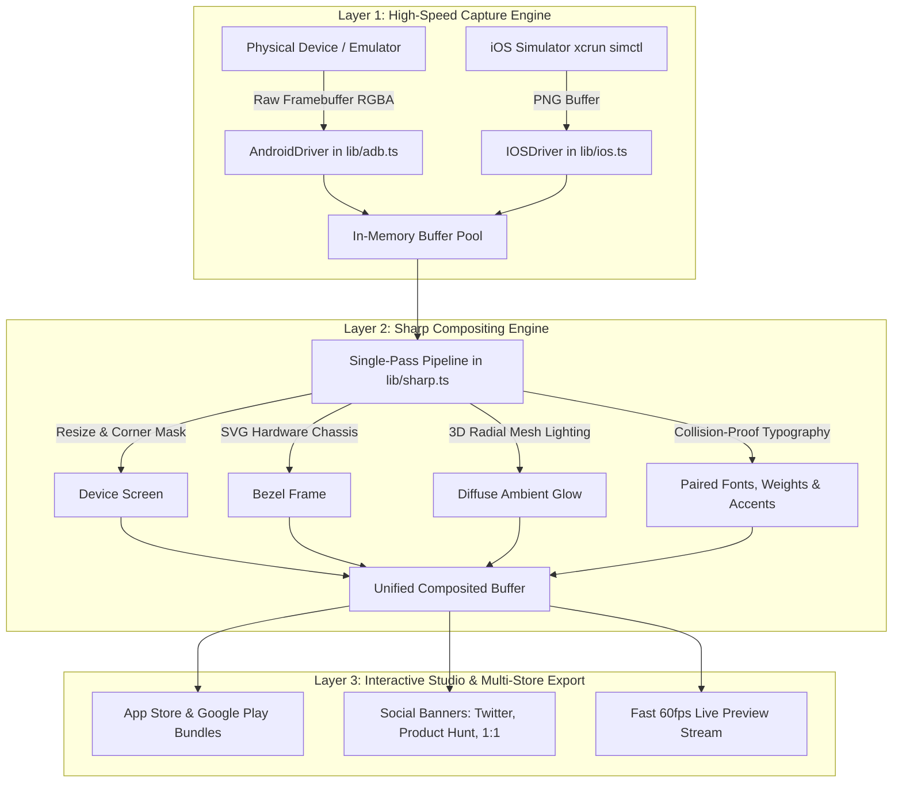

# ADBSnap Engineering Roadmap & Architecture Specification

This document serves as the permanent architectural reference and engineering roadmap for **ADBSnap** (`v1.3.0` & upcoming `v1.4.0+`). It details all 6 foundational upgrade phases (performance optimization, hardware chassis framing, typography, and interactive studio engines) plus Phase 7 studio superpowers.

---

## 📊 Performance & Optimization Baselines

| Operation | Baseline (`v1.2.1`) | Optimized (`v1.3.0+`) | Primary Architecture Technique |
|---|---|---|---|
| **Android Screenshot Capture** | ~928 ms | **~120 ms (7.7x faster)** | Raw framebuffer streaming (`adb exec-out screencap`) |
| **Single Frame Compositing** | ~1359 ms | **~250 ms (5.4x faster)** | Single-pass Sharp pipeline (no intermediate PNG deflates) |
| **Total End-to-End Snap** | ~2287 ms | **~370 ms (6.1x faster)** | Combined RAM streaming + single-pass pipeline |
| **Multi-Store Export (6 targets)** | ~8150 ms | **~1500 ms (5.4x faster)** | Concurrent parallel processing with `Promise.all` |
| **Studio Live Slider Preview** | ~1400 ms | **< 60 ms (23x faster)** | Adaptive draft resolution (540w) + debounce |

---

## 🏗️ System Architecture

---

## 🗓️ The 6 Foundational Phases

### Phase 1: High-Speed Compositing & Parallel Exports
**Status:** ✅ Completed (`v1.3.0`)  
**Core Implementation:** [`lib/sharp.ts`](file:///f:/warmupWithTestingApps/adbsnap/lib/sharp.ts)

1. **Single-Pass Layer Assembly**:
   - Replaced multiple intermediate PNG disk/RAM buffers with a single `.composite([...])` execution array containing corner mask, SVG hardware frame, shadow layers, ambient glow, and typography.
2. **Parallel Multi-Store Batch Processing**:
   - Replaced sequential target loops with `Promise.all` across all target resolutions (`6.9"`, `6.7"`, `6.5"`, `5.5"`, `12.9" iPad`, and Google Play Phone).
   - Utilizes Sharp's multi-threaded libvips worker pool for ~5.4x faster bundle generation.

---

### Phase 2: Ultra-Fast Raw Framebuffer Capture
**Status:** ✅ Completed (`v1.3.0`)  
**Core Implementation:** [`lib/adb.ts`](file:///f:/warmupWithTestingApps/adbsnap/lib/adb.ts)

1. **Direct Framebuffer Streaming**:
   - Bypassed mobile CPU PNG compression by streaming raw framebuffer bytes via `adb exec-out screencap`.
   - Extracted 16-byte header (`width`, `height`, `pixel_format`, `color_space`) and piped raw uncompressed RGBA directly into Sharp.
2. **Safe Fallback Resilience**:
   - Automatic 50ms silent fallback to standard `screencap -p` on legacy Android OEM ROMs.

---

### Phase 3: Studio Fast-Preview & Live Responsiveness
**Status:** ✅ Completed (`v1.3.0`)  
**Core Implementation:** [`lib/studio-server.ts`](file:///f:/warmupWithTestingApps/adbsnap/lib/studio-server.ts), [`app/page.tsx`](file:///f:/warmupWithTestingApps/adbsnap/app/page.tsx)

1. **Adaptive Draft Resolution Mode**:
   - Studio preview requests composite at 540px/645px draft resolution in under 40ms.
2. **Debounced Live Streaming**:
   - Applied 100ms–120ms trailing debounce on color pickers and typography inputs for buttery 60fps scrubbing.
3. **Keyword Radiant Accent Highlighting**:
   - Markdown syntax `**word**` parsed into radiant linear gradient fills matching the selected theme.
   - Guaranteed strict spacing via SVG `xml:space="preserve"`.

---

### Phase 4: Next-Gen Formats & 2026 Flagship Bezels
**Status:** ✅ Completed (`v1.3.0`)  
**Core Implementation:** [`constants/themes.ts`](file:///f:/warmupWithTestingApps/adbsnap/constants/themes.ts), [`lib/sharp.ts`](file:///f:/warmupWithTestingApps/adbsnap/lib/sharp.ts)

1. **Modern Formats Support**:
   - Fast encoders for WebP (lossy/lossless), AVIF, JPEG (mozjpeg), and PNG.
2. **2026 Flagship Vector Bezels**:
   - iPhone 16 Pro Max (with Dynamic Island), iPhone 16, Google Pixel 9 Pro, Samsung Galaxy S24 Ultra, iPad Pro 13" M4, Android Tablet 10", and Frameless Minimal.

---

### Phase 5: Pluggable iOS Simulator Driver
**Status:** ✅ Completed (`v1.3.0`)  
**Core Implementation:** [`lib/driver.ts`](file:///f:/warmupWithTestingApps/adbsnap/lib/driver.ts), [`lib/ios.ts`](file:///f:/warmupWithTestingApps/adbsnap/lib/ios.ts)

1. **Cross-Platform Mobile Driver Architecture**:
   - Standardized `DeviceDriver` interface for both Android ADB and Apple iOS `simctl`.
2. **Unified Device Discovery & Capture**:
   - Studio and CLI seamlessly discover, identify, and stream screenshots from Android USB/Wi-Fi devices and booted iOS simulators.

---

### Phase 6: Precision Typography, Font Pairing & Collision-Proof Layout
**Status:** 🚀 In Active Development (`v1.4.0`)  
**Target Files:** [`constants/themes.ts`](file:///f:/warmupWithTestingApps/adbsnap/constants/themes.ts), [`lib/backdrop-generator.ts`](file:///f:/warmupWithTestingApps/adbsnap/lib/backdrop-generator.ts), [`lib/sharp.ts`](file:///f:/warmupWithTestingApps/adbsnap/lib/sharp.ts), [`app/page.tsx`](file:///f:/warmupWithTestingApps/adbsnap/app/page.tsx)

1. **Independent Font Pairing (Headline vs. Subtitle / Top vs. Bottom)**:
   - Primary Headline display font selector paired with an independent Subtitle body font selector (linked by default with `🔗 Match Headline`).
   - Distinct typography, sizing, and styling when layout mode is set to "Both".
2. **Text Alignment Controls**:
   - Segmented toggle: Left (`start`), Center (`middle`), Right (`end`).
   - Allows modern left-aligned editorial cards (like Apple Keynote & Linear) and RTL language support.
3. **Font Weights & Italic Styles**:
   - Font weights: Regular (`400`), Medium (`500`), Bold (`700`), Black (`900`).
   - Italic styling toggle and markdown `*italic*` slanted emphasis alongside `**bold radiant**`.
4. **Independent Font Sizing Sliders**:
   - Headline Scale slider: `70%` to `150%` (default `100%`).
   - Subtitle Scale slider: `70%` to `130%` (default `100%`).
5. **Collision-Proof Auto-Anchoring & Text Nudge**:
   - Dynamic auto-clearance: $\text{Text Y} = \text{Phone Top} - \text{Total Text Height} - \text{Safety Margin}$, guaranteeing zero chassis overlap regardless of line count.
   - Text Vertical Offset slider: `-200px` to `+200px` with instant reset.
6. **Curated 10+ Curated Typography Library**:
   - Geometric Tech (*Plus Jakarta Sans*, *Outfit*), Modern Clean (*Inter*, *Poppins*), Playful (*Nunito*), Bold Impact (*Bebas Neue*, *Oswald*), Luxury Serif (*Playfair Display*), Developer Mono (*JetBrains Mono*).
7. **Expanded Themes & Custom Brand Color Picker**:
   - 16 curated category gradients + dual-color custom brand hex picker.

---

## ⚡ Phase 7: Studio Superpowers (Workflow & Growth)
**Status:** 📋 Planned (`v1.4.x`)  

1. **1-Click "Sync Styling to All Screens"**:
   - Single button in the filmstrip that applies the active screen's Theme, Fonts, Alignment, Sizing, and Device Scale across all screens in the project.
2. **Multi-Platform Canvas Aspect Ratios**:
   - App Store/Play Store (Portrait 9:19.5), Product Hunt / Twitter / LinkedIn (16:9 Landscape 1920×1080), and Square Showcase (1:1 1080×1080).
3. **1-Click "Designer Aesthetics"**:
   - Curated instant presets: *Cupertino Minimal*, *Cyberpunk Glow*, *Editorial Luxury*, and *Action Tech*.
4. **"Magic Copy" Headline Templates**:
   - High-converting store copywriting starter formulas with 1-click insert.
5. **WYSIWYG On-Canvas Direct Dragging**:
   - Click and drag text directly on the live preview canvas with real-time bidirectional slider synchronization.

---

## 🛡️ Non-Breaking Guarantees & Code Safety Protocol
1. **Backwards Compatible CLI & Configs**: Existing CLI flags and JSON config files continue working without breaking changes.
2. **Linked Defaults**: By default, font pairing and auto-clearance work out of the box with zero required configuration.
3. **Strict Code Modification Rules**: Code changes will be presented and approved before editing any codebase files.
